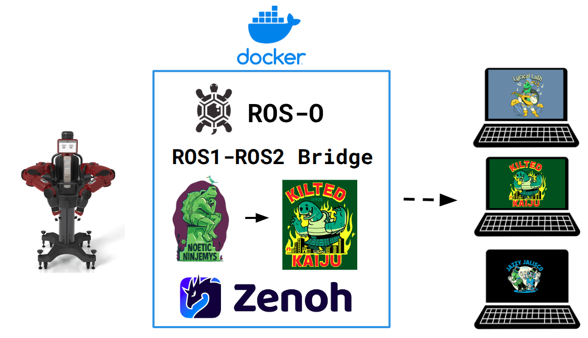

This container bridges Baxter's ROS 1 (`rosmaster` on the robot) to ROS 2 on your laptop using `ros1_bridge` over Zenoh.


---

## 1. One-time setup

<details>
<summary><b>Network configuration (run once per machine)</b></summary>

Connect your laptop to the robot via Ethernet, then run:

```bash
bash network_setup.sh
```

This installs the `Rethink` NetworkManager profile and adds `baxter.local` to `/etc/hosts`.

Then add the following to your `~/.bashrc` so every terminal is configured for the robot:

```bash
export ROS_MASTER_URI=http://10.42.0.2:11311
export ROS_IP=10.42.0.1
unset ROS_HOSTNAME
```

</details>

Build the bridge Docker image:

```bash
docker build -t baxter_bridge:latest .
```

---

## 2. Each session

**Connect to the robot**
```bash
nmcli connection up Rethink
ping -c1 10.42.0.2        # should succeed before continuing
```

**Run the bridge**
```bash
docker run --rm --network=host baxter_bridge:latest
```

The bridge loads `bridge_topics.yaml` from inside the container and starts forwarding all configured topics and services between ROS 1 and ROS 2.

---

## 3. Using the bridge from ROS 2

In a separate terminal on your laptop:

```bash
source /opt/ros/<jazzy|kilted|lyrical>/setup.bash
unset ROS_DOMAIN_ID
export RMW_IMPLEMENTATION=rmw_zenoh_cpp

cd ~/host_ws/
colcon build
source install/setup.bash
```

Then run `rviz2`, `rqt`, or your own nodes. All topics in `bridge_topics.yaml` are now available on the ROS 2 side.

---

## 4. Controlling the robot

**Enable / disable (required before sending commands)**
```bash
# Baxter
rosrun baxter_tools enable_robot.py -e   # enable
rosrun baxter_tools enable_robot.py -d   # disable

# Sawyer
rosrun intera_interface enable_robot.py -e
rosrun intera_interface enable_robot.py -d
```

**Verify joint states are flowing**
```bash
ros2 topic echo /robot/joint_states
```

> **Note:** You do not have root access on the robot. All custom nodes must run on your own machine.
